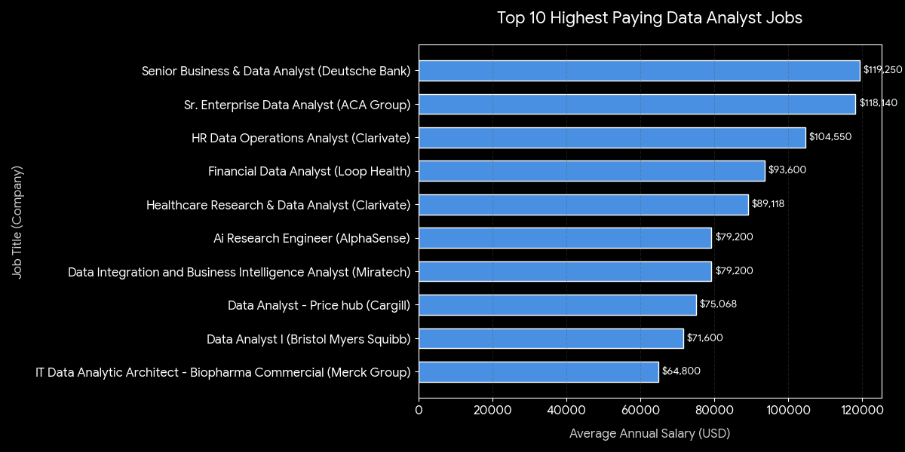
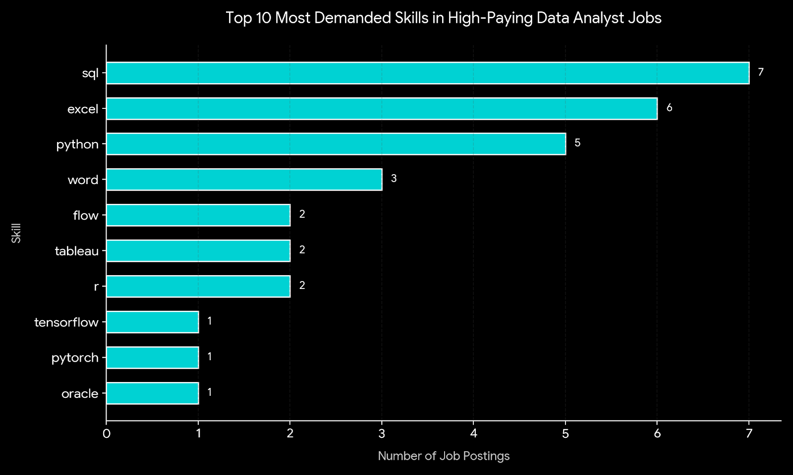
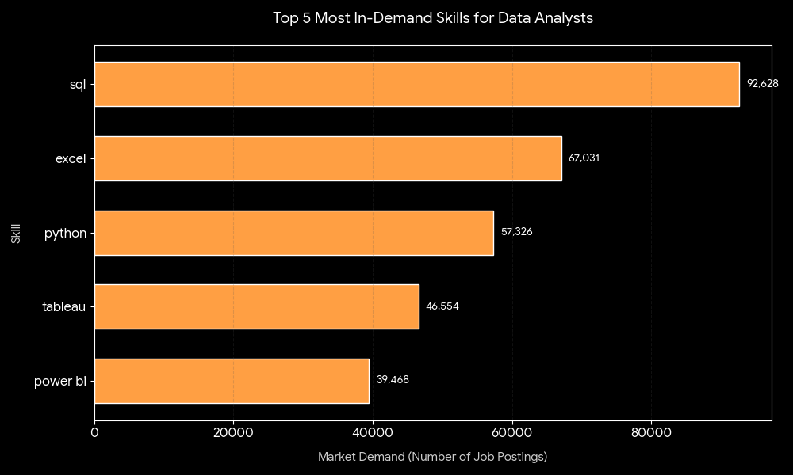
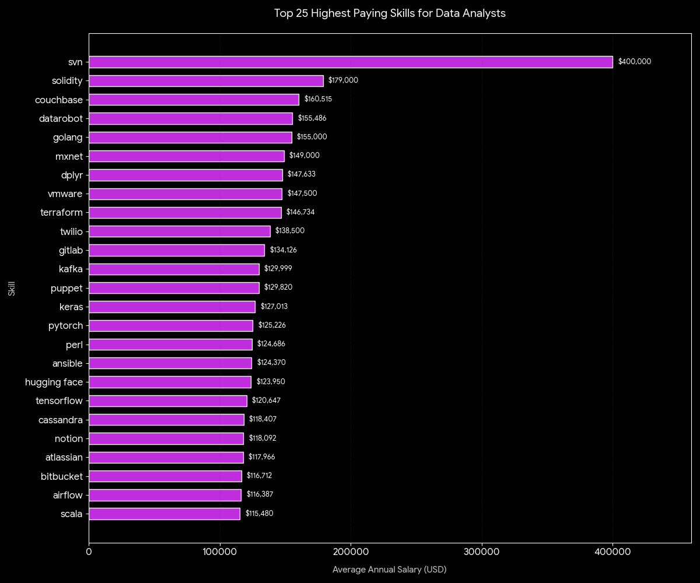

# 📊 Data Job Market Analysis

A SQL-based project analyzing data analyst job postings to find the best balance between job demand and salary potential.

## 🎯 Project Goal

This project explores the data job market through a series of SQL queries focused on five questions:

1. 💰 What are the top-paying remote data analyst jobs?
2. 👑 Which skills are required for those high-paying roles?
3. 🔥 Which skills are most in demand across the entire market?
4. 💵 Which skills are associated with the highest average salaries?
5. ⚖️ What skills offer the best balance of demand and pay?

The objective is to turn raw job-posting data into practical career insights.

---

## 🛠️ Tools Used

- 🐘 **PostgreSQL:** The core database engine used to clean, filter, and analyze the dataset.
- 💻 **VS Code:** The local development environment used to write and format the SQL scripts.
- 🔧 **SQLTools extension:** Used to connect to the local database and execute queries.
- 🗂️ **Git & GitHub:** For version control and project sharing.

---

## 📁 Project Structure

The analysis is organized into five standalone SQL files:

- 📄 `1_top_paying_jobs.sql`
- 📄 `2_top_paying_job_skills.sql`
- 📄 `3_top_demanded_skills.sql`
- 📄 `4_top_paying_skills.sql`
- 📄 `5_optimal_skills.sql`

Each script addresses a specific business question and builds toward the final career strategy.

---

## 🔍 Analysis Summary

### 1. 💰 Top-Paying Remote Data Analyst Jobs
This query finds the top 10 highest-paying remote data analyst roles, filtering out postings that do not include salary data.
- ⚙️ **SQL Mechanics:** Uses explicit filters (`IS NOT NULL` and `WHERE job_location = 'Anywhere'`) sorted via `ORDER BY` with a strict `LIMIT 10`.
- 📈 **What it shows:** Remote data analyst jobs can reach strong salary levels in industries like consulting, finance, and technology, establishing a clear ceiling for potential earnings.



---

### 2. 🔍 Skills Required for Top-Paying Jobs
This query looks at those top 10 highest-paying remote roles to see exactly what tools employers are looking for at that level.
- ⚙️ **SQL Mechanics:** Executes an inner join linking the job postings table to the skills dimension tables to isolate the tech requirements of the highest-paying subset.
- 📈 **What it shows:** High-paying jobs don't just require rare or specialized tools; they heavily rely on a core stack. **SQL, Excel, and Python** formed the most common combination even at the highest pay scales.



---

### 3. 🔥 Most In-Demand Skills
This query identifies the skills that appear most frequently across the entire unfiltered dataset, regardless of salary or location.
- ⚙️ **SQL Mechanics:** Uses count aggregations (`COUNT(job_id)`) grouped by skill name (`GROUP BY`) and ordered by descending frequency volume.
- 📈 **What it shows:** **SQL** leads the market with 92,628 mentions (~30.6% market volume), making it a foundational requirement. **Excel** closely follows with 67,031 mentions (~22.1%), proving that spreadsheet tools remain essential across the wider industry.



---

### 4. 💡 Skills with the Highest Average Salaries
This query calculates the global average annual salary associated with each individual skill to see which ones carry a financial premium.
- ⚙️ **SQL Mechanics:** Combines inner joins with an average aggregation (`AVG(salary_year_avg)`) while filtering out undisclosed salaries.
- 📈 **What it shows:** High market demand does not always equal a high salary. Niche tools like Web3 (**Solidity**), specialized data scaling (**Couchbase**), and automation/deployment frameworks (**Terraform**, **Kafka**, **Airflow**) command the highest salaries because the pool of talent is relatively small.



---

### 5. ⚖️ Best Balance of Demand and Salary
This final query combines demand and salary data to find the most practical, high-value skills to learn—maximizing both job options and pay.
- ⚙️ **SQL Mechanics:** Uses dual aggregations (`COUNT()` and `AVG()`) in a single query block, filtering for remote roles and using a `HAVING COUNT(*) > X` clause to remove low-sample outliers.
- 📈 **What it shows:** * 🚀 **Python** offers the strongest balance, pairing a high volume of job options (1,840 postings) with a six-figure average salary ($101,512).
  * ⚓ **SQL ($96,435)** and **Tableau ($97,978)** act as essential foundations, ensuring wide employability while maintaining a competitive salary.
  * 📉 **Excel** offers high job availability (2,143 postings) but carries a lower financial return, averaging $86,419.

| Skill Name | Demand Count | Average Salary (USD) |
| :--- | :---: | :---: |
| SQL | 3,083 | $96,435 |
| Excel | 2,143 | $86,419 |
| Python | 1,840 | $101,512 |
| Tableau | 1,659 | $97,978 |
| R | 1,073 | $98,708 |
| Power BI | 1,044 | $92,324 |
| Word | 527 | $82,941 |
| PowerPoint | 524 | $88,316 |
| SAS | 500 | $93,707 |
| SQL Server | 336 | $96,191 |

---

## 🏆 Key Takeaways

- 🔑 **SQL** is the most critical foundational skill required across the entire analysis.
- ⚖️ **Python** and **Tableau** provide the best balance between high job demand and strong market salaries.
- 🛡️ Specialized data operations and cloud tools pay more, but they generally feature much lower market demand.
- 🎯 **The Strategy:** Master the core tools first (SQL, Tableau, Python) to maximize your interview pipeline, then layer on high-paying niche skills later for financial leverage.

---

## 🧠 What I Learned

This project provided practical experience with relational database workflows:
- 💡 Translating open-ended business questions into structured SQL queries.
- 🔗 Using multi-table inner joins to connect job data with required skills.
- 🧮 Using aggregation functions like `COUNT()`, `AVG()`, `GROUP BY`, and `HAVING` filters.
- 🧹 Cleaning raw data by identifying and filtering out `NULL` records.
- 🎯 Extracting clear conclusions and summaries from query outputs.


All data visualizations and charts featured in this project were generated via Gemini.*

---

## 💻 How to Use This Repository

1. **Clone the repository locally:**
```bash
git clone [https://github.com/blackbean0099/SQL_PROJECT_DATA_JOBS_ANALYSIS.git](https://github.com/blackbean0099/SQL_PROJECT_DATA_JOBS_ANALYSIS.git)
